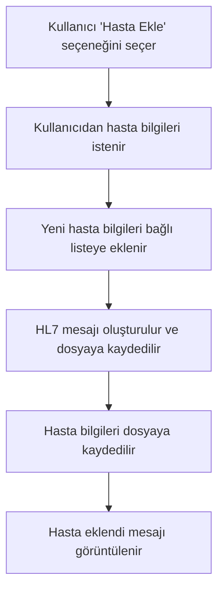
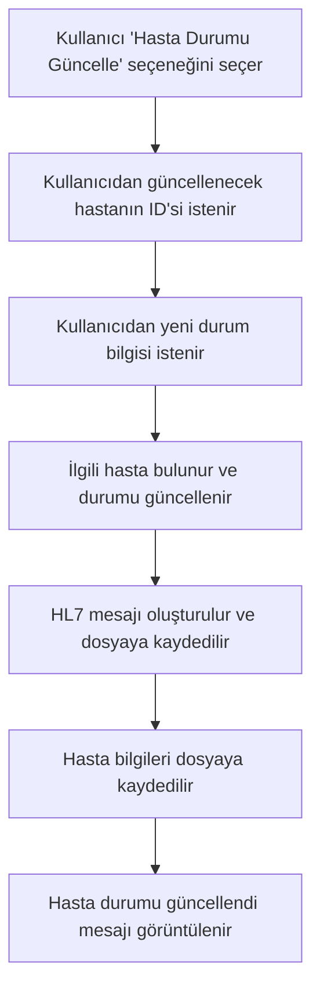
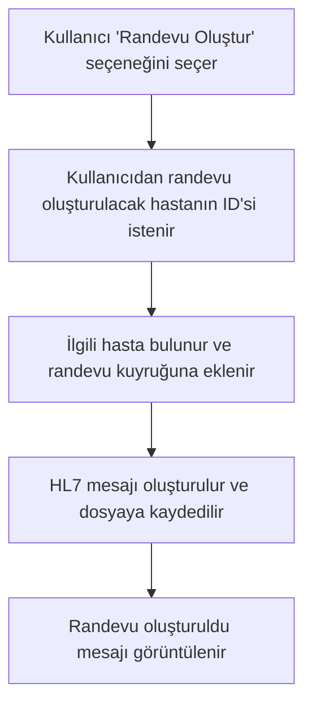
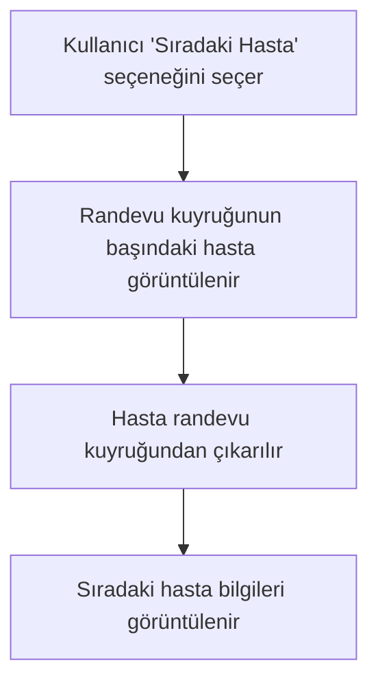
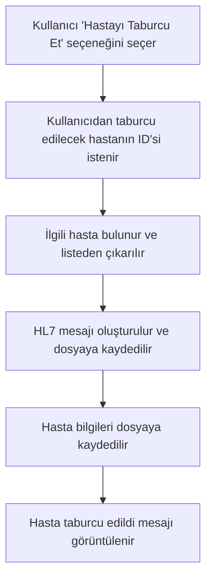

# Proje Analiz Dökümanı

## Giriş

Bu belge, "Hastane Yönetim Sistemi" projesinin tasarımını ve çalışma mantığını açıklamaktadır. Proje, hastane operasyonlarını yönetmek için bir dizi işlevsellik sağlar ve hasta verilerini, reçeteleri ve randevuları yönetir.

## Akış Şemaları

### Hasta Ekleme Akış Şeması

### Hasta Durumu Güncelleme Akış Şeması

### Randevu Oluşturma Akış Şeması

### Sıradaki Hasta Akış Şeması

### Hasta Taburcu Etme Akış Şeması

## Çalışma Mantığı

- **Hasta Bilgileri:** Hasta bilgileri `Hasta` yapısında tutulur ve bağlı liste yapısı ile yönetilir.
- **Reçete Bilgileri:** Reçete bilgileri `Recete` yapısında tutulur ve bağlı liste yapısı ile yönetilir.
- **Randevu Sistemi:** Randevular, hastaların acil olup olmamasına göre önceliklendirilir ve bağlı liste ile yönetilir.
- **Dosya İşlemleri:** Hasta ve reçete bilgileri dosyaya kaydedilir ve dosyadan okunur. Ayrıca HL7 mesajları dosyaya kaydedilir.
- **HL7 Mesajları:** HL7 formatında mesajlar oluşturulur ve dosyaya kaydedilir.

## Sonuç

Bu proje, hastane yönetim sisteminin temel işlevlerini simüle eden bir C programıdır. Kullanıcı dostu arayüzü ve kapsamlı işlevleri ile hastane operasyonlarını etkin bir şekilde yönetmeyi amaçlar.
