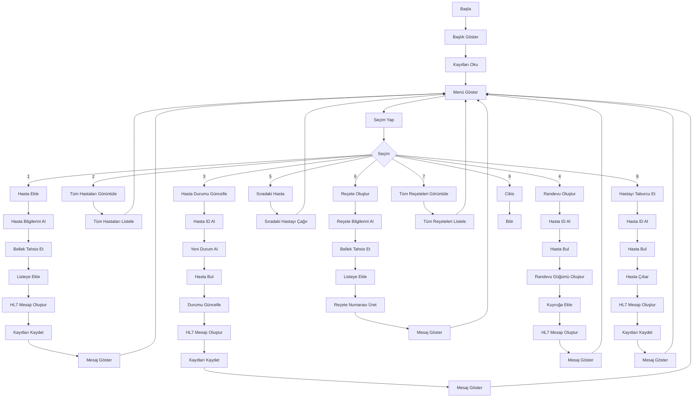

# Hastane Yönetim Sistemi Proje Analizi

## Projenin Amacı
Bu proje, bir hastane yönetim sistemi uygulamasının temel işlevlerini içerir. Kullanıcılar hasta ekleyebilir, hasta bilgilerini güncelleyebilir, reçete oluşturabilir ve randevu oluşturabilir. Ayrıca, HL7 formatında mesajlar oluşturulup kaydedilir.

## Kullanıcı İhtiyaçları
- **Hasta Ekleme:** Yeni hasta kaydı oluşturma ve bilgilerini saklama.
- **Hasta Bilgilerini Görüntüleme:** Sisteme kayıtlı tüm hastaların bilgilerini listeleme.
- **Hasta Durumunu Güncelleme:** Mevcut bir hastanın durumunu değiştirme.
- **Reçete Oluşturma:** Hastalar için ilaç reçetesi hazırlama.
- **Randevu Oluşturma:** Hastalar için randevu oluşturma ve randevu sırasını yönetme.
- **Sıradaki Hastayı Çağırma:** Randevu sırasındaki sıradaki hastayı çağırma.
- **Hasta Taburcu Etme:** Bir hastayı sistemden çıkarma.
- **HL7 Mesajları:** HL7 formatında mesajlar oluşturma ve kaydetme.

## Sistem Gereksinimleri
- **Girdi:** Hasta bilgileri, reçete bilgileri, randevu bilgileri.
- **Çıktı:** Hasta listesi, reçete listesi, randevu listesi, HL7 mesajları.
- **Veri Depolama:** Hasta bilgileri, reçete bilgileri ve HL7 mesajları dosyalarda saklanır.
- **Bellek Yönetimi:** Dinamik bellek tahsisi kullanılarak bağlı listeler oluşturulur.

## Fonksiyonlar ve İşlevleri
- **baslikGoster:** Programın başlığını ekrana yazdırır.
- **menuGoster:** Kullanıcıya mevcut seçenekleri gösterir.
- **hastaEkle:** Yeni hasta kaydı oluşturur.
- **tumHastalariGoruntule:** Sisteme kayıtlı tüm hastaları listeleme.
- **hastaDurumuGuncelle:** Mevcut bir hastanın durumunu günceller.
- **receteOlustur:** Yeni bir reçete oluşturur.
- **tumReceteleriGoruntule:** Sistemde kayıtlı tüm reçeteleri görüntüler.
- **randevuOlustur:** Hastalar için randevu oluşturur.
- **siradakiHasta:** Sıradaki hastayı çağırır.
- **hastayiTaburcuEt:** Bir hastayı sistemden çıkarır.
- **hastaIdAl:** Kullanıcıdan hasta ID'si alır.
- **receteNoUret:** Rastgele bir reçete numarası oluşturur.
- **freeReceteNo:** Reçete numarasını serbest bırakır.
- **hl7MesajiOlustur:** HL7 formatında bir mesaj oluşturur.
- **oncelikSor:** Hastanın acil olup olmadığını sorar.
- **siraNoUret:** Otomatik bir sıra numarası üretir.
- **kayitlariDosyayaKaydet:** Hasta bilgilerini bir dosyaya yazar.
- **kayitlariDosyadanOku:** Hasta bilgilerini bir dosyadan okur.
- **hl7MesajiDosyayaKaydet:** HL7 mesajlarını bir dosyaya ekler.

## Akış Şeması

## Geliştirme Süreci
Bu bölümde, projenin geliştirme aşamaları ve süreçleri hakkında bilgi verilir.

- **Aşama 1:** Analiz ve Planlama
- **Aşama 2:** Tasarım
- **Aşama 3:** Geliştirme
- **Aşama 4:** Test ve Doğrulama
- **Aşama 5:** Dağıtım ve Bakım

## Sonuç
Bu bölümde, projenin genel sonuçları ve elde edilen başarılar özetlenir.

- **Başarı 1:** Açıklama
- **Başarı 2:** Açıklama
- **Başarı 3:** Açıklama
